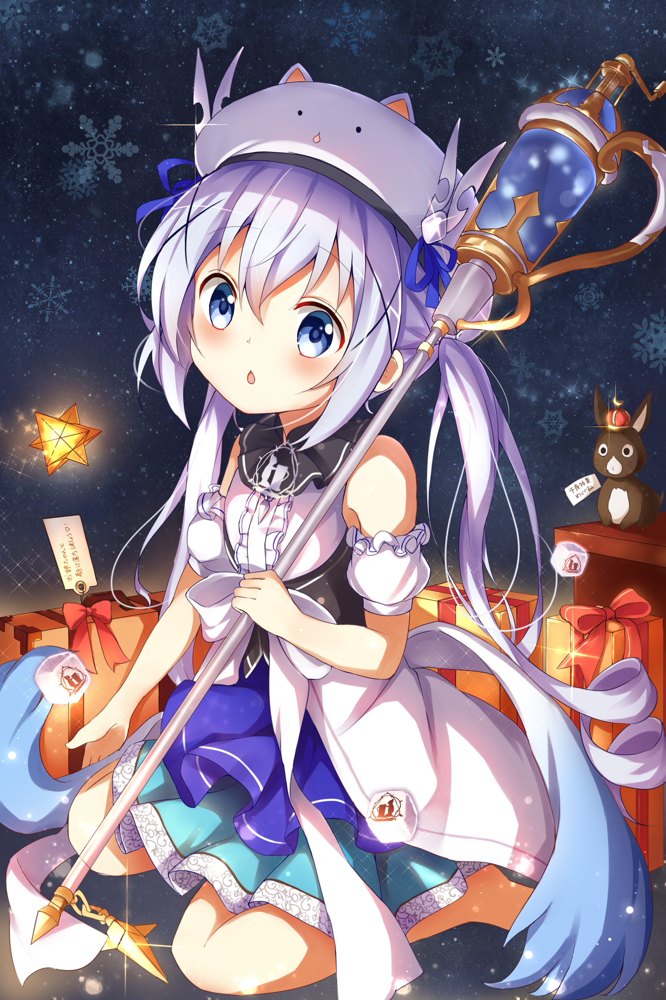
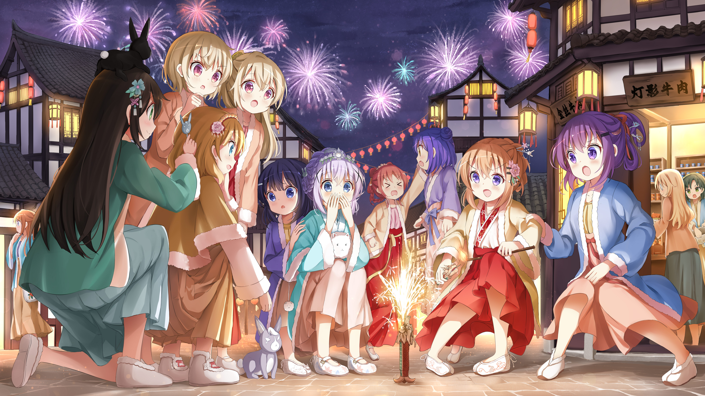
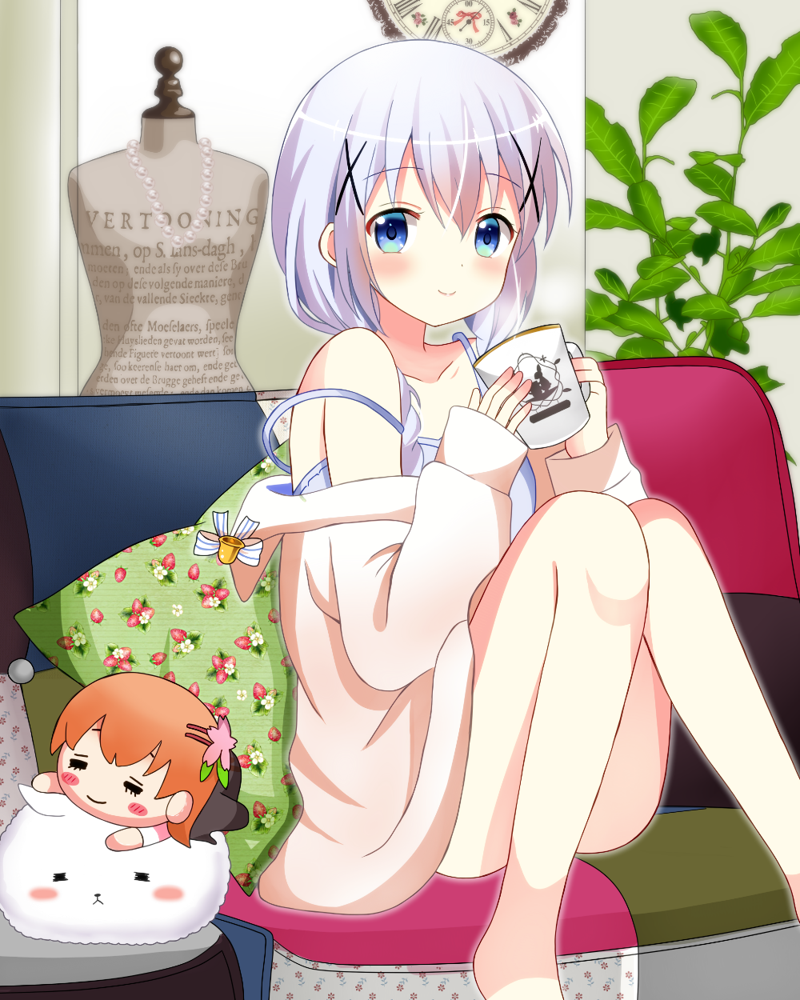

<h1 align="center">Hi~ I'm Asperformias  ~ ♡ </h1>

  
  
  

## 📖About

Just a mediocre student. I set foot the computer world with cybersecurity and some simple penetration. For me, computing feels less like an 'industry,' 'job,' or 'interest,' and more like a kind of... fate?

## 🧑‍🤝‍🧑Visitors

## 💻 Skills

### OS

### Language & Frameworks

### Tool

